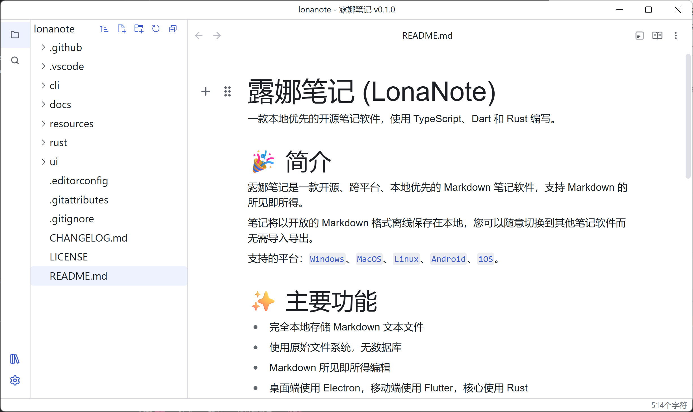
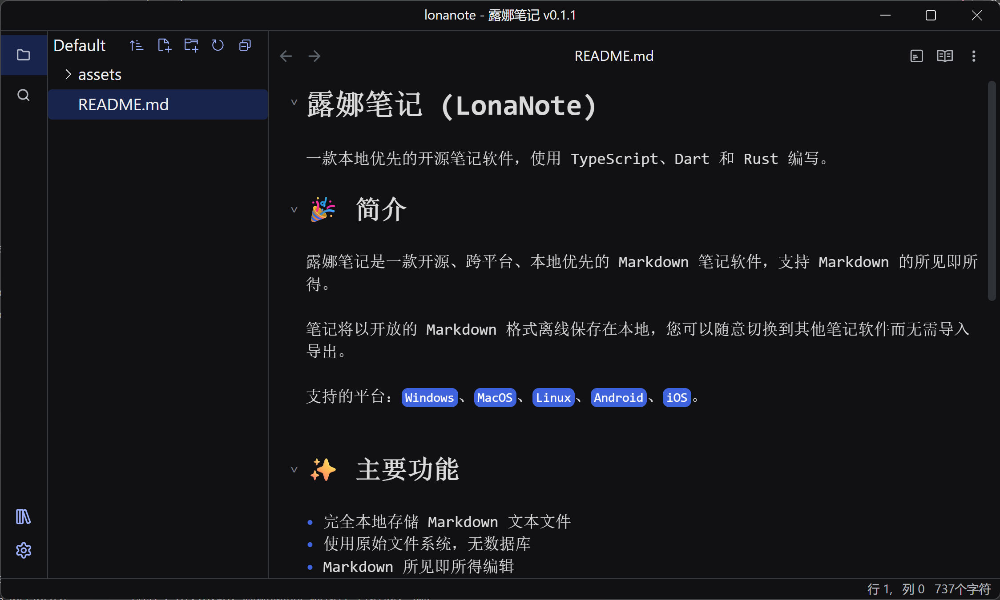
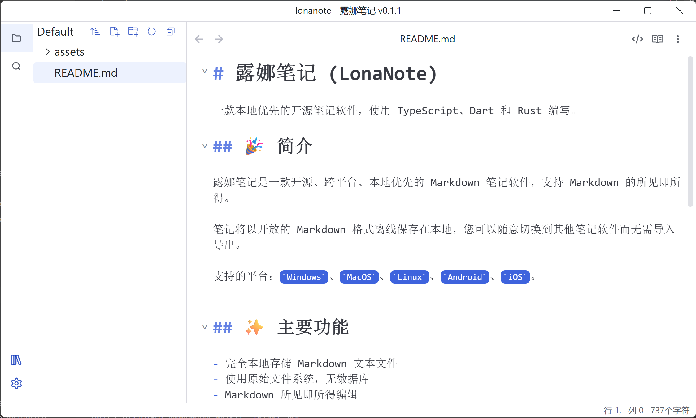
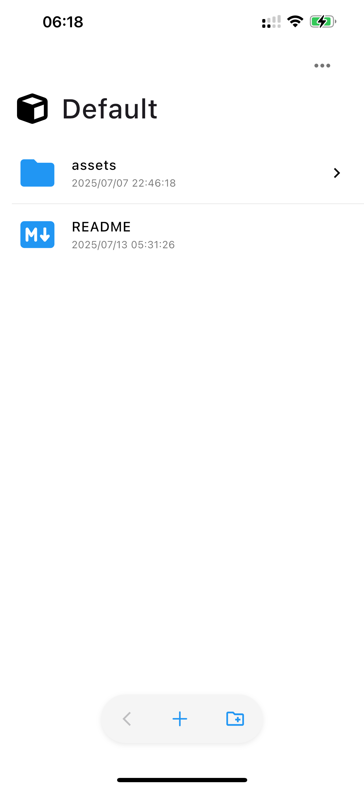
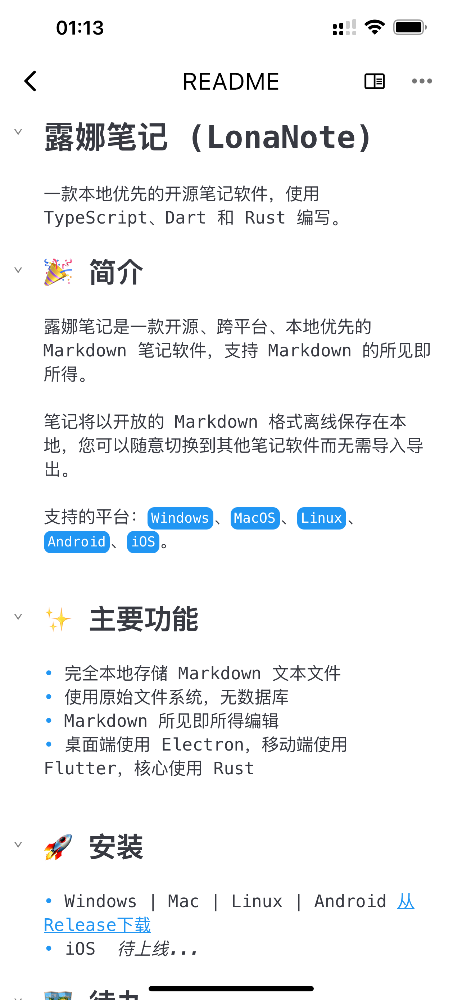
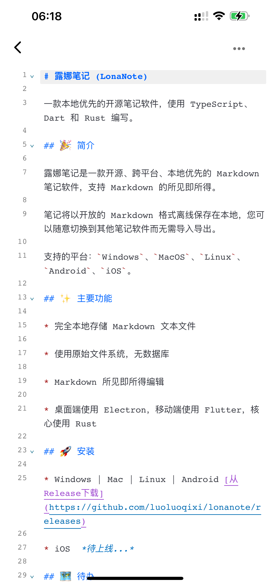
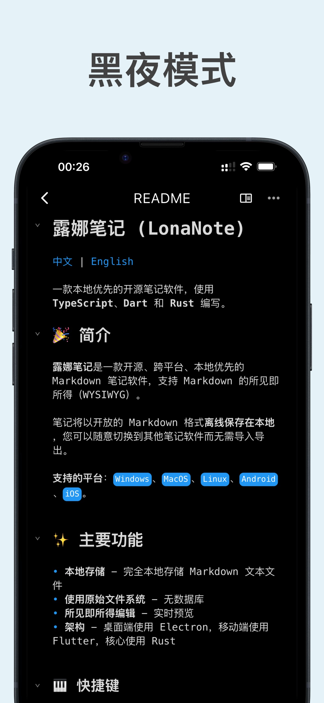
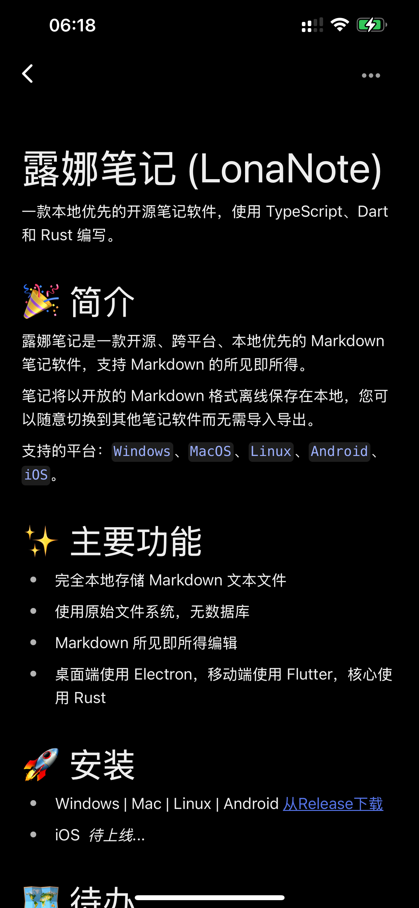
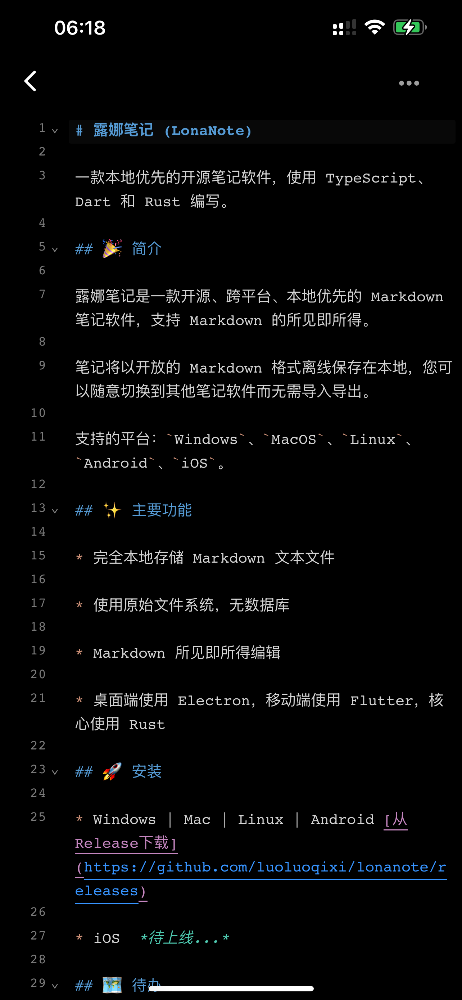

# 露娜笔记 (LonaNote)

一款本地优先的开源笔记软件，使用 TypeScript、Dart 和 Rust 编写。

## 🎉 简介

露娜笔记是一款开源、跨平台、本地优先的 Markdown 笔记软件，支持 Markdown 的所见即所得。

笔记将以开放的 Markdown 格式离线保存在本地，您可以随意切换到其他笔记软件而无需导入导出。

支持的平台：`Windows`、`MacOS`、`Linux`、`Android`、`iOS`。

## ✨ 主要功能

- 完全本地存储 Markdown 文本文件
- 使用原始文件系统，无数据库
- Markdown 所见即所得编辑
- 桌面端使用 Electron，移动端使用 Flutter，核心使用 Rust

<table>
  <tr>
    <td></td>
    <td></td>
  </tr>
</table>

 

<table>
  <tr>
    <td></td>
    <td></td>
  </tr>
</table>

 

<table>
  <tr>
    <td></td>
    <td></td>
    <td></td>
  </tr>
</table>

 

<table>
  <tr>
    <td></td>
    <td></td>
    <td></td>
  </tr>
</table>

## 🚀 安装

- Windows | Mac | Linux | Android [从Release下载](https://github.com/luoluoqixi/lonanote/releases)
- iOS  *待上线...*

## 🗺 待办

露娜笔记在积极开发中，欢迎贡献代码

[待办事项](./docs/dev/todo.md)

## 💬 社区

[Github Discussions](https://github.com/luoluoqixi/lonanote/discussions)

QQ 群：978017481

## 🔨 开发指南

请查看 [开发文档](./ui/README.md)

## 📝 许可证

[MIT license](https://github.com/luoluoqixi/lonanote/blob/main/LICENSE)

