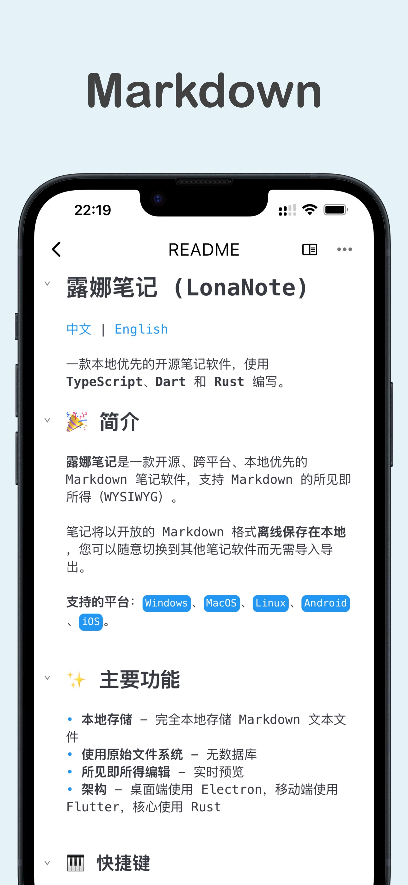

# 露娜笔记 (LonaNote)

[中文](./README.md) | [English](./README_en.md)

一款本地优先的开源笔记软件，使用 **TypeScript**、**Dart** 和 **Rust** 编写。

## 🎉 简介

**露娜笔记**是一款开源、跨平台、本地优先的 Markdown 笔记软件，支持 Markdown 的所见即所得（WYSIWYG）。

笔记将以开放的 Markdown 格式**离线保存在本地**，您可以随意切换到其他笔记软件而无需导入导出。

**支持的平台**：`Windows`、`MacOS`、`Linux`、`Android`、`iOS`。

## ✨ 主要功能

- **本地存储** - 完全本地存储 Markdown 文本文件
- **使用原始文件系统** - 无数据库
- **所见即所得编辑** - 实时预览
- **架构** - 桌面端使用 Electron，移动端使用 Flutter，核心使用 Rust

### 📸 屏幕截图

#### 桌面端 (白天/黑夜模式)

    
    

#### 移动端 (白天/黑夜模式)

    
    

### 🎹 快捷键

**LonaNote** 提供以下快捷键来提高编辑效率：

`Ctrl+B` - **加粗**

`Ctrl+I` - *斜体*

`Ctrl+D` - ~~删除线~~

`Ctrl+H` - ==高亮==

### 🔧 斜线菜单

在编辑器中输入 / 字符可以触发斜线菜单，快速插入各种 Markdown 语法元素

## 🚀 安装

- **Windows | Mac | Linux | Android**： [从Release下载](https://github.com/luoluoqixi/lonanote/releases)
- **iOS**：[App Store](https://apps.apple.com/app/app/id6752297620)

## ❓ 常见问题

- **Mac** 提示 `lonanote.app已损坏，无法打开， 你应该将它移到废纸篓。`
  - 由于未签名, 首次运行需要执行 `xattr -c lonanote.app` 才能打开
  - 相关链接: [electron-builder #8191](https://github.com/electron-userland/electron-builder/issues/8191)、[discussions](https://discussions.apple.com/thread/253714860?sortBy=best)

## 🗺 待办

露娜笔记在积极开发中，欢迎贡献代码

- [v1.1.0 TODO](https://github.com/users/luoluoqixi/projects/4)

## 💬 社区

- [Github Discussions](https://github.com/luoluoqixi/lonanote/discussions)

- QQ 群：978017481

## 🔨 开发指南

请查看 [开发文档](./ui/README.md)

## 🙏 致谢

特别感谢这些优秀项目带来的灵感：

- [PurrMD](https://github.com/luoluoqixi/purrmd) - 所见即所得编辑器支持
- [HyperMD](https://github.com/laobubu/HyperMD) - 开创性的 WYSIWYG Markdown 编辑体验
- [CodeMirror6](https://codemirror.net/) - 强大的编辑器内核

如果没有以上项目，那么就不会有 LonaNote

## 📝 许可证

[MIT license](https://github.com/luoluoqixi/lonanote/blob/main/LICENSE)

