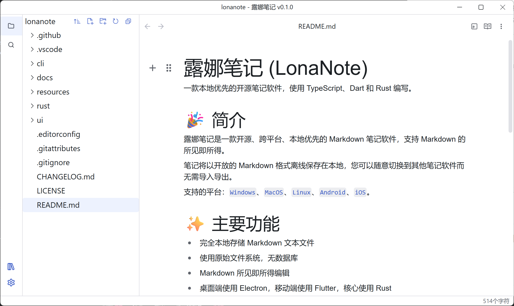
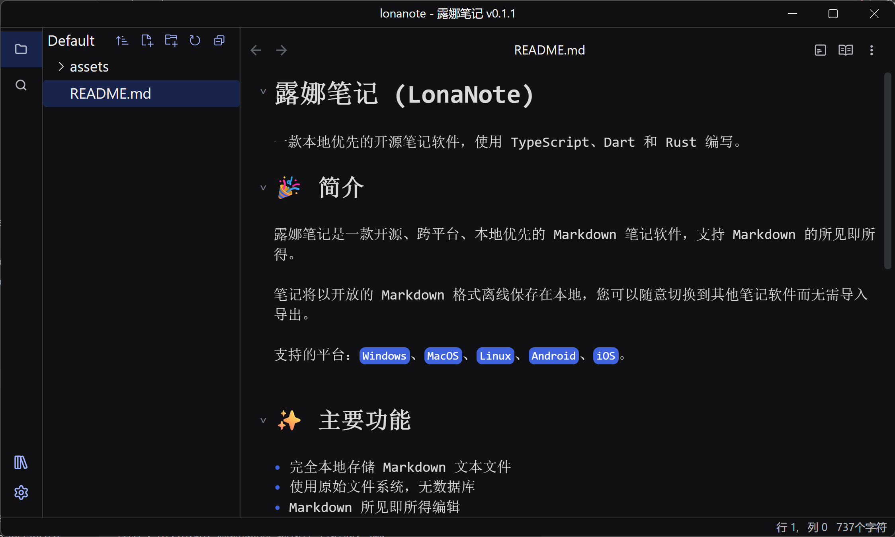
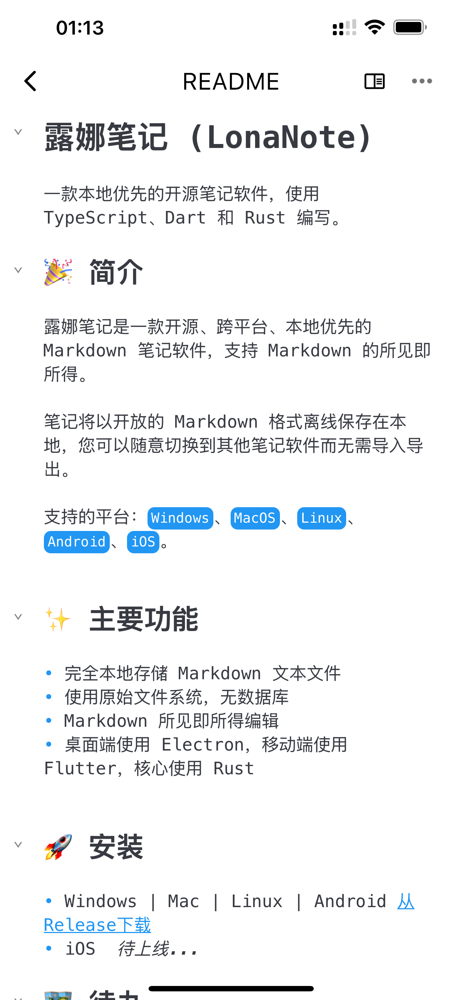
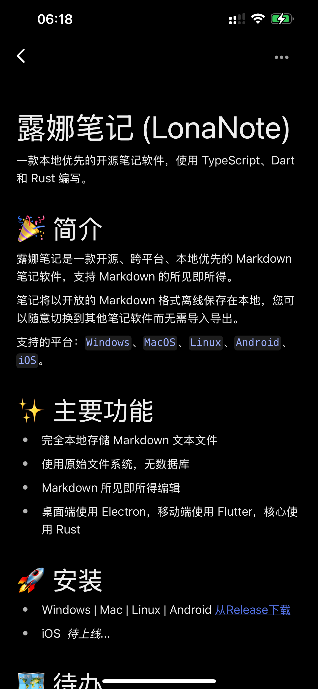

# LonaNote

[中文](./README.md) | [English](./README_en.md)

A local-first, open-source note-taking app built with **TypeScript**, **Dart**, and **Rust**.

## 🎉 Introduction

**LonaNote** is an open-source, cross-platform, local-first Markdown note-taking app with WYSIWYG (What You See Is What You Get) editing.

Notes are **stored offline** in plain Markdown format, allowing seamless migration to other note-taking apps without import/export hassles.

**Supported Platforms**: `Windows`, `macOS`, `Linux`, `Android`, `iOS`.

## ✨ Key Features

- **Local storage** - Plain Markdown files, no vendor lock-in
- **File-system based** - No proprietary databases
- **WYSIWYG editing** - Real-time preview
- **Hybrid architecture** - Flutter (ui), Rust (core)

### 📸 Screenshots

#### Desktop (Light/Dark Mode)

    
    

#### Mobile (Light/Dark Mode)

    
    

### 🎹 Shortcuts

**LonaNote** provides the following shortcuts to improve editing efficiency:

`Ctrl+B` - Bold

`Ctrl+I` - Italic

`Ctrl+D` - Strikethrough

`Ctrl+H` - Highlight

### 🔧 Slash Menu

Typing the / character in the editor triggers a slash menu, allowing quick insertion of various Markdown syntax elements

## 🚀 Installation

- **Windows | macOS | Linux | Android**: [Download from Releases](https://github.com/luoluoqixi/lonanote/releases)
- **iOS**: [App Store](https://apps.apple.com/app/app/id6752297620)

## ❓ FAQ

- Mac prompts `lonanote.app Is Damaged and Can’t Be Opened. You Should Move It To The Trash`
  - Due to being unsigned, you need to execute `xattr -c lonanote.app` to open it for the first time.
  - Related links: [electron-builder #8191](https://github.com/electron-userland/electron-builder/issues/8191), [discussions](https://discussions.apple.com/thread/253714860?sortBy=best)

## 🗺 Roadmap

LonaNote is under active development—contributions welcome!

- [v1.1.0 TODO](https://github.com/users/luoluoqixi/projects/4)

## 💬 Community

- [GitHub Discussions](https://github.com/luoluoqixi/lonanote/discussions)
- **QQ Group**: 978017481

## 🔨 Development Guide

See [Developer Documentation](./ui/README.md).

## 🙏 Acknowledgments

Special thanks to these excellent projects for inspiration:

- [PurrMD](https://github.com/luoluoqixi/purrmd) - WYSIWYG editor support
- [HyperMD](https://github.com/laobubu/HyperMD) - Pioneering WYSIWYG Markdown editing experience
- [CodeMirror6](https://codemirror.net/) - Powerful editor core

Without the above projects, PurrMD would not exist.

## 📝 License

[MIT License](https://github.com/luoluoqixi/lonanote/blob/main/LICENSE)
