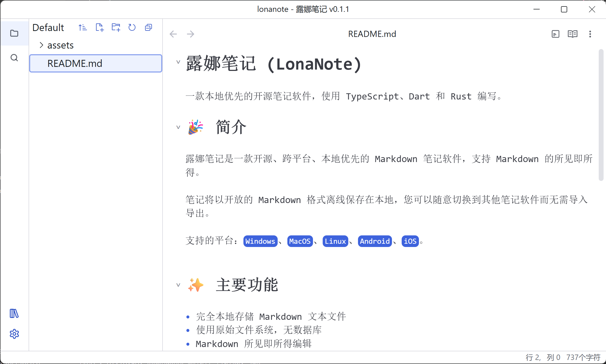

# LonaNote

[中文](./README.md) | [English](./README_en.md)

A local-first, open-source note-taking app built with TypeScript, Dart, and Rust.

## 🎉 Introduction

LonaNote is an open-source, cross-platform, local-first Markdown note-taking app with WYSIWYG (What You See Is What You Get) editing.

Notes are stored offline in plain Markdown format, allowing seamless migration to other note-taking apps without import/export hassles.

**Supported Platforms**: `Windows`, `macOS`, `Linux`, `Android`, `iOS`.

## ✨ Key Features

- **Local storage** - Plain Markdown files, no vendor lock-in
- **File-system based** - No proprietary databases
- **WYSIWYG Markdown editing** - Real-time preview
- **Hybrid architecture** - Electron (desktop), Flutter (mobile), Rust (core)

### 📸 Screenshots

#### Desktop (Light/Dark Mode)

    
    

#### Mobile (Light/Dark Mode)

    
    

## 🚀 Installation

- **Windows | macOS | Linux | Android**: [Download from Releases](https://github.com/luoluoqixi/lonanote/releases)
- **iOS**: *Coming soon...*

## 🗺 Roadmap

LonaNote is under active development—contributions welcome!

- [v0.2.0 TODO](https://github.com/users/luoluoqixi/projects/3)

- [v1.0.0 TODO](https://github.com/users/luoluoqixi/projects/4)

## 💬 Community

- [GitHub Discussions](https://github.com/luoluoqixi/lonanote/discussions)
- **QQ Group**: 978017481

## 🔨 Development Guide

See [Developer Documentation](./ui/README.md).

## 📝 License

[MIT License](https://github.com/luoluoqixi/lonanote/blob/main/LICENSE)
