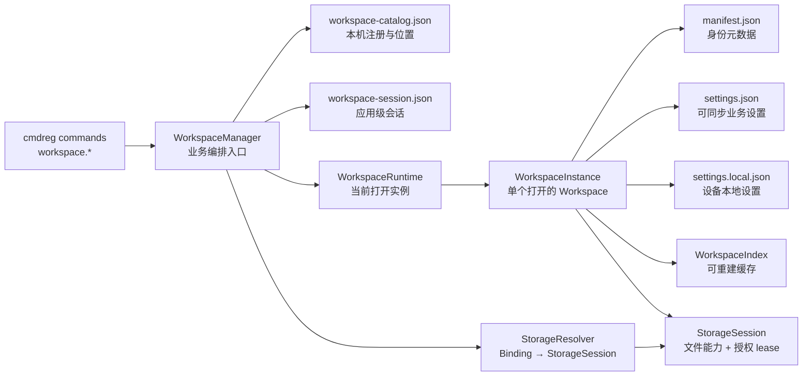
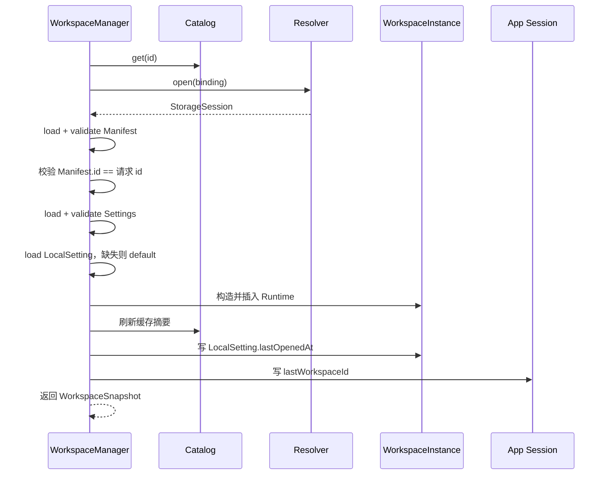

# Rust Workspace Core 架构指南

> 本文描述当前已经落地的 Rust Workspace 实现，面向第一次阅读代码、维护 Workspace 生命周期或接入上层 API 的开发者。

## 1. 范围与结论

对应代码：

- [`rust/core/src/workspace`](../../rust/core/src/workspace/)
- [`rust/core/src/api/workspace`](../../rust/core/src/api/workspace/)
- [`rust/core/tests/workspace`](../../rust/core/tests/workspace/)

当前已经实现并验证：

- 普通 Rust 文件系统；
- Tauri 桌面目录与 Android/iOS 应用沙盒目录的 Local FS 接入；
- 用于 contract test 的内存 Storage；
- Workspace 创建、挂载、打开、关闭、移除与迁移；
- Workspace 文件操作、Settings、LocalSetting 和 File Tree Index；
- 面向上层调用的 cmdreg command API；
- 与当前 cmdreg 契约对齐的 TypeScript `workspace`、`workspaceFile`、`workspaceIndex` wrapper。

Android SAF、iOS bookmark/iCloud 和用户自选目录 Provider 不在当前范围内。TypeScript Workspace API 已接入现有 Rust 能力；未来平台 Provider 的授权与资源选择接口仍需单独实现。

旧 v1 的 `workspaces.json` 与 `.lonanote/workspace.json` 不会被读取、迁移或改写。当前格式要求新的 `manifest.json` 与 `settings.json`。

## 2. 核心心智模型

Workspace 是拥有稳定 `WorkspaceId` 的业务对象，不是一个绝对路径。



必须保持的边界：

- `WorkspaceId` 不等于路径，移动目录不改变 ID。
- Manifest 只保存身份元数据，不保存 Settings、绝对路径或授权数据。
- `settings.json` 保存应随 Workspace 同步的业务设置。
- `settings.local.json` 保存单个 Workspace 在当前设备上的恢复设置，并由 Git 忽略。
- Catalog 只回答“当前设备如何找到 Workspace”并保存列表摘要。
- 应用级 Session 只保存跨 Workspace 的当前应用会话，例如最后打开的 Workspace ID。
- Runtime 与 Index 只存在于内存，可关闭、失效或重建。
- command API 是 Manager 的薄适配层，不直接修改 Catalog、Storage 或 Runtime。

## 3. 代码分层

```text
rust/core/src/workspace/
├── mod.rs                   # 统一 re-export、全局 Manager 安装
├── error.rs                 # Domain、Storage、Workspace 错误
├── manager.rs               # 跨组件生命周期与业务编排门面
├── domain/
│   ├── identity.rs          # WorkspaceId、StorageProviderId
│   ├── directory_name.rs    # Managed 目录名
│   ├── relative_path.rs     # 安全相对路径与 EntryName
│   ├── binding.rs           # Managed / External Binding
│   ├── manifest.rs          # manifest.json 模型
│   ├── settings.rs          # settings.json 模型
│   ├── local_setting.rs     # settings.local.json 模型
│   ├── record.rs            # Catalog record 与缓存摘要
│   └── dto.rs               # API 返回 DTO
├── persistence/
│   ├── json_file.rs         # 应用数据 JSON 的原子替换与 backup 恢复
│   ├── catalog.rs           # workspace-catalog.json
│   └── session.rs           # workspace-session.json
├── storage/
│   ├── mod.rs               # Storage/Resolver/Session contract 与 Workspace JSON I/O
│   ├── local.rs             # 普通文件系统实现
│   └── memory.rs            # 测试用内存实现
├── runtime/
│   ├── mod.rs               # 已打开 Instance 的 Arc 表
│   ├── instance.rs          # 单 Workspace 行为与修改锁
│   └── index.rs             # File Tree 缓存和失效
└── file_tree/               # native-path File Tree

rust/core/src/api/workspace/
├── workspace_api.rs         # 生命周期、Settings、LocalSetting、App Session
├── file_api.rs              # 文件能力与 CRUD
└── index_api.rs             # File Tree 查询与刷新
```

| 层 | 负责 | 不负责 |
|---|---|---|
| Domain | ID、路径、Binding、JSON 模型和 DTO 的合法性 | I/O、生命周期编排 |
| Persistence | 应用数据目录中的 Catalog 与 App Session | Workspace 目录内容 |
| Storage | 单个 Workspace root 内的文件能力和 JSON 文件读写 | 注册、当前打开状态 |
| Runtime | 当前进程已打开的 Instance | 持久化注册表 |
| Instance | 单 Workspace 的 Manifest、Settings、LocalSetting、文件和 Index | 跨 Workspace 生命周期 |
| Manager | 组合所有组件完成业务流程 | 平台 UI、TypeScript 状态 |
| API | JSON 参数与 Manager 的薄适配 | 复制业务规则 |

`manager.rs` 只有一个主要门面，因此保留为顶层单文件。其他拥有多个概念的层使用子目录拆分。

### 3.1 平台启动与 Manager 安装

Workspace Core 不自行猜测平台目录。平台壳负责提供可访问的 app data / sandbox 路径，并在任何 command 调用前安装一个全局 `WorkspaceManager`。

平台壳也必须在加载 Manager 前将系统 BCP 47 locale 写入 Core 的全局 `config::system_locale`。Tauri 通过 `sys-locale` 获取它；Android/iOS 由 TypeScript 在同步原生 `init` 调用中传入。后续 Rust 业务直接读取该上下文，不在业务 API 上传递 locale 参数。


Tauri 在原生 `setup` 阶段同步完成这个流程。Android/iOS 的流程由 TypeScript 显式启动：

```text
RootLayout
  → initializeRustRuntime()（同步）
  → expo-file-system Paths.document.uri
  → Intl.DateTimeFormat().resolvedOptions().locale
  → LonanoteRustModule.init(sandboxPath, systemLocale)
  → Rust 校验 sandboxPath 是绝对、存在且位于原生模块 data path 内
  → 初始化 AppPaths
  → LocalFsResolver(providerId = "app-local", root = <sandbox>)
  → WorkspaceManager::load(<sandbox>)
  → 仅首次启动：使用 app-local 创建并复制默认 Workspace
  → install_workspace_manager
  → 注册 cmdreg
```

因此移动端从 TS 传递 sandbox path 与系统 BCP 47 locale。Catalog 与 App Session 位于该 sandbox 根目录；`app-local` Managed Workspace 位于 `<sandbox>/workspaces/<directoryName>`。移动端沙盒已经由系统隔离到当前应用，不再额外创建 `lonanote` 目录。初始化发生在 `RootLayout` 组件创建前，只有 Rust Core、Provider 与 Manager 全部就绪后才开始渲染应用界面；普通 command 仍会同步检查初始化状态作为防御。

Core 初始化必须保持为有界的本地启动工作：注册 command、初始化 AppPaths、声明当前平台支持的 Storage Provider、加载本地 Catalog/App Session/Manager，并仅在首次启动时复制默认 Workspace。SAF/bookmark 授权弹窗、网络同步、用户目录选择和其他交互式或长耗时流程不属于 Core 初始化，必须在启动完成后由 TypeScript 显式发起异步请求。

旧的 `path.init_dir` 命令已经移除。路径初始化是平台启动职责，不能由任意业务 command 在 runtime 中途重写。移动端当前只注册 Managed `app-local` Provider，不把任意外部路径暴露为 External Local FS；未来的 SAF/bookmark 必须作为各自的授权 Provider 接入。

平台支持的 Provider ID 同样以 Resolver 的实际注册结果为唯一事实来源。`WorkspaceStorageResolver::provider_ids()` 返回排序且去重后的完整列表，`WorkspaceManager::storage_provider_ids()` 只负责转发，Core 通过统一 command `workspace.list_storage_provider_ids` 暴露该结果。创建 Managed Workspace 时，前端应改用 `WorkspaceStorageResolver::managed_provider_ids()` 与 `workspace.list_managed_storage_provider_ids`，以排除必须先由平台层取得具体资源授权的 External Provider。Craby Native 与 Tauri 继续复用已有的通用 `invoke`，不维护专用桥接接口。当前移动端的 Managed 列表为 `app-local`；桌面始终包含 `app-local`，在系统能解析 Documents 路径时额外包含 `desktop-documents`，完整列表另含 `desktop-folder`。TypeScript 不维护重复常量。

这个列表表示“当前平台安装了对应 Provider 能力”，不表示某个具体目录已经获得 bookmark/SAF 等访问授权。Provider 的 label、介绍和后续能力描述可以在上层功能实现时扩展，但是否实际支持某个 Provider 仍由 Rust 平台初始化决定。

Provider ID 由 Provider 实现方定义，但它是会进入 Catalog Binding 的稳定协议标识，不是面向用户的显示名称。ID 只能使用小写 ASCII 字母、数字、`-`、`_`、`.`。优先按访问语义命名，例如应用自有且无需授权的目录使用 `app-local`；确实属于特定平台的能力再使用 `desktop-*`、`ios-*`、`android-*` 前缀，例如 `desktop-documents`、`ios-icloud`。一旦投入生产，重命名需要 Catalog 迁移；label 与介绍应作为独立展示元数据演进。

## 4. 持久化数据设计

### 4.1 Workspace 目录结构

创建后的关键结构如下：

```text
<workspace root>/
├── .lonanote/
│   ├── manifest.json
│   ├── settings.json
│   ├── settings.local.json
│   └── .gitignore
└── ...默认 Workspace 文件与用户文件
```

`.lonanote/.gitignore` 默认包含：

```gitignore
settings.local.json
```

因此未来基于 Git 的同步天然得到以下行为：

| 文件 | 默认进入 Git/同步 | 原因 |
|---|---:|---|
| `manifest.json` | 是 | Workspace 身份与名称应跟随目录 |
| `settings.json` | 是 | 业务设置应跨设备共享 |
| `settings.local.json` | 否 | 最近文件等设备本地恢复信息不应共享 |

迁移 Workspace 目录是本机文件复制，会复制整个目录，包括 `settings.local.json`；Git 同步是否包含文件则由 `.gitignore` 决定。这两个流程语义不同。

### 4.2 Manifest：身份元数据

位置：`<workspace root>/.lonanote/manifest.json`

```json
{
  "schemaVersion": 1,
  "id": "canonical-lowercase-uuid",
  "displayName": "个人笔记",
  "createdAt": 0
}
```

Manifest 是以下字段的权威来源：

- 稳定 `WorkspaceId`；
- 用户可见名称；
- 创建时间；
- Manifest 自己的 schema version。

它不再嵌入 Settings。修改显示名称只重写 Manifest，并同步更新 Catalog 的缓存摘要。

### 4.3 Settings：可同步业务设置

位置：`<workspace root>/.lonanote/settings.json`

```json
{
  "schemaVersion": 1,
  "fileTreeSortType": "name",
  "followGitignore": true,
  "customIgnore": "...",
  "uploadImagePath": "assets/images",
  "uploadAttachmentPath": "assets/attachments",
  "historySnapshotCount": 20
}
```

可选的 `sync` 扩展也属于这个文件。Settings 拥有独立且必填的 schema version，未来可以在不改变 Manifest schema 的情况下演进。

`settings.json` 是当前格式的必需文件：打开或 attach 时缺失会返回 `SettingsNotFound`，不会默默从旧 Manifest 恢复，因为当前重构明确不承担 v1 兼容迁移。

### 4.4 LocalSetting：Workspace 内的设备本地设置

位置：`<workspace root>/.lonanote/settings.local.json`

```json
{
  "schemaVersion": 1,
  "lastOpenedAt": 0,
  "lastOpenFile": "notes/today.md"
}
```

LocalSetting 保存：

- 此 Workspace 在当前设备的最后打开时间；
- 此 Workspace 在当前设备的最后打开文件；
- 独立 schema version。

该文件默认被 Git 忽略。文件缺失不是错误：例如从 Git clone 得到 Workspace 时它通常不存在，打开流程会使用默认值，并在记录打开时间时重新创建文件。

LocalSetting 必须通过已经打开的 `WorkspaceInstance` 访问。这保证它使用与 Workspace 相同的 Storage session 和平台授权生命周期。

### 4.5 Catalog：本机 Workspace 注册表

位置：`<app data>/workspace-catalog.json`

当前 Catalog schema version 为 1。项目尚处于开发阶段，`providerSchemaVersion` 与 `resourceIdentity` 直接属于 version 1 的既定格式，不产生迁移。

Catalog 保存：

- `WorkspaceId → WorkspaceStorageBinding`；
- 列表展示用的 `displayName`、`createdAt` 缓存摘要；
- 最近验证摘要的时间。
- `initialWorkspaceCopied`：一次性历史标记；首次默认 Workspace 成功写入时设为 `true`，之后即使用户删除该 Workspace 也不会再次复制。
- `initialWorkspaceId`：首次默认 Workspace 的 ID。用户普通删除后仍保留，用于保留历史；GM 调试重置时用于精确定位待删除的 Workspace。

Binding 可以是 Managed，也可以是 External。它可能包含本机路径或未来平台授权引用，因此不能进入 Workspace 目录。

External Binding 使用经过校验的 `StorageResourceRef` 值对象，而不是裸 `String`。JSON 仍表现为 `resourceRef` 字符串；它的具体语义由 `providerId` 对应的 Resolver 解释。普通 Rust 文件系统将其解释为绝对路径，未来平台可以将其解释为 bookmark、SAF URI 或安全存储引用 ID。

进入 Catalog 的 Binding 还包含：

- `providerSchemaVersion`：Provider 自己的数据格式版本，由对应 Resolver 校验；
- `resourceIdentity`：Resolver 根据 Provider 规则生成的稳定绑定身份，用于判断两个 Binding 是否代表同一个存储目标或访问范围；它不要求等同于底层目录 inode。

```json
{
  "kind": "external",
  "providerId": "desktop-folder",
  "providerSchemaVersion": 1,
  "resourceRef": "/Users/example/Notes",
  "resourceIdentity": "local-fs:path-sha256:4b6d..."
}
```

API 输入使用独立的 `WorkspaceStorageBindingRequest`，该类型根本不包含 `resourceIdentity`。Manager 调用 `Resolver.resolve_identity()` 后，显式构造 identity 必填的 `WorkspaceStorageBinding`；因此未解析状态无法进入 Catalog。`resourceIdentity` 不能用于打开目录，所以 `resourceRef` 仍然必需。

Provider 的 `resourceRef` 编码发生变化时，只提升 `providerSchemaVersion` 并让 Resolver 支持或迁移对应版本，不需要提升整个 Catalog schema。待格式投入生产后，只有 Catalog 公共 envelope 本身发生不兼容变化时才需要提升 Catalog schema。

同一个 Provider 必须让 `resourceIdentity` 的语义跨 Provider schema version 保持稳定；否则升级前后的 Binding 无法可靠执行 `same_resource()`。identity 标识访问绑定，权限当前是否有效是另一件事，应由 Resolver `open()` 返回 `AuthorizationRequired`、`AuthorizationRevoked` 等状态。

Catalog 主文件、backup 和 App Session 通过原子临时文件写入；Unix 平台上的文件权限固定为 `0600`。完整 Binding 只用于 Core 内的定位，不会由 attach/remove/relocate command 返回，上层只得到不含 `resourceRef` 的 `WorkspaceStorageView`。

缓存摘要允许应用在不打开所有 Workspace 的情况下列出工作区。Manifest 仍是名称和创建时间的最终权威；每次成功打开会刷新摘要。

### 4.6 App Session：应用级会话

位置：`<app data>/workspace-session.json`

```json
{
  "schemaVersion": 1,
  "lastWorkspaceId": "canonical-lowercase-uuid"
}
```

当前 Session 只保存最后打开的 Workspace ID。它不属于任何单个 Workspace，也不混入 Catalog。和其他持久化模型一样，schema version 是必填字段。

Manager 启动时会用 Catalog 的有效 ID 集合 reconcile Session：如果最后打开 ID 已经不在 Catalog 中，就将其清空。移除 Workspace 时也会清空指向该 ID 的 Session。

未来只有真正属于“整个应用当前会话”的字段才应加入这里；某个 Workspace 自己的本机设置应加入 `settings.local.json`。

### 4.7 Runtime 与 Index

`WorkspaceRuntime` 本质上是：

```text
HashMap<WorkspaceId, Arc<WorkspaceInstance>>
```

Runtime 不持久化。关闭 Workspace 是从 map 移除 `Arc`，已经获得 Instance 的进行中操作仍可安全完成。

`WorkspaceIndex` 是 File Tree 派生缓存：

- 首次查询时构建；
- 文件写入、创建目录、重命名、删除后失效；
- 后续查询重新构建；
- `refresh_index` 可显式强制刷新。

### 4.8 权威来源速查

| 问题 | 权威来源 |
|---|---|
| Workspace 稳定 ID、名称、创建时间 | Manifest |
| 文件树、上传路径、历史数量、同步配置 | Settings |
| 此 Workspace 在本机最后打开的文件 | LocalSetting |
| 当前设备去哪里找到 Workspace | Catalog Binding |
| 未打开时列表显示什么 | Catalog cached summary |
| 整个应用最后打开哪个 Workspace | App Session |
| Workspace 当前是否打开 | Runtime |
| 当前 File Tree 缓存 | Index，可重建 |

## 5. Storage 抽象

### 5.1 Binding、Resolver、Session、Storage

```text
WorkspaceStorageBindingRequest
  → WorkspaceStorageResolver.resolve_identity(request)
  → WorkspaceStorageBinding（resource identity 必填）
  → 写入 Catalog
  → WorkspaceStorageResolver.open(binding)
  → WorkspaceStorageSession
      ├── Arc<dyn WorkspaceStorage>
      └── 可选 WorkspaceAccessLease
```

- BindingRequest：API、Manager 与 Resolver 之间的临时输入，不进入 Catalog。
- Binding：Resolver 已解析的持久化领域模型，`resourceIdentity` 必填，只存入 Catalog。
- Resolver：理解 Binding，负责生成资源 identity、校验 Provider schema version，并打开或创建实际存储。
- Resolver 还声明当前平台实际注册的 Provider ID；Manager 和平台 bridge 只读取该列表，不自行推断或复制。
- Session：把文件能力与访问授权 lease 绑定到同一生命周期。
- Storage：只接受 `WorkspaceRelativePath` 的文件能力接口。

`WorkspaceAccessLease` 为 iOS security-scoped access、Android SAF 等预留。即使当前普通文件系统不需要 lease，生命周期边界已经固定。

`WorkspaceStorageBindingRequest` 与 `WorkspaceStorageBinding` 是两个独立结构，不互相嵌套；它们只共享描述 Managed/External 差异的 `WorkspaceStorageLocation`。`WorkspaceStorageBinding::PartialEq` 表示已解析 Binding 的所有结构字段完全相同，不用于 Provider 目标判断。目标等价判断使用 `same_resource()`，其语义是 `providerId + resourceIdentity` 相同；定位引用判断使用 `same_reference()`。

各类 Provider 的 identity 规则：

- Desktop 普通 Local FS：规范化路径后计算 SHA-256 identity；消除 `.`、`..`，Windows 统一路径分隔符，macOS 与 Windows 统一转为小写。相同路径删除后重新创建仍视为同一个绑定目标，不读取 inode、volume ID 或 file index，也不在 identity 中重复暴露原始路径。
- Android/iOS 用户自选目录：应标识持久授权引用本身，例如 bookmark 或 SAF grant。只要原授权引用仍能访问该目录，即使目录曾删除后重新创建，也保持相同 identity；授权是否仍有效由 `open()` 判断。
- Android/iOS 应用沙盒目录：应用始终拥有权限，identity 由 Provider scope 与 Workspace 相对路径生成即可。

identity 不负责自动追踪目录移动。应用内显式 `relocate_workspace` 会解析目标 Request、复制 Workspace，并以新的 Binding 更新 Catalog；之后只使用新目录打开。若未来支持“用户在系统文件管理器中移动后重新选择”，应提供显式 rebind 操作，不能让普通 attach 静默覆盖已有 Workspace ID。

因此 `/notes/../notes` 这类语法等价路径可以幂等 attach，并会在 relocate 时返回 `SameStorageBinding`；symlink 等指向同一物理目录但路径不同的引用仍视为不同绑定。复制到另一条路径但保留相同 Manifest ID 的目录也会被判定为冲突。

### 5.2 路径安全

所有 Workspace 内路径都先转换为 `WorkspaceRelativePath`：

- 根目录用空字符串表示；
- 拒绝绝对路径；
- 拒绝 `.`、`..`、空 segment 和反斜杠；
- 文件 API 不接受任意本机路径。

普通文件系统实现还会做 root confinement，防止通过符号链接等方式越出 Workspace root。

### 5.3 能力与 native path

`WorkspaceStorage` 暴露 `StorageCapabilities`，上层应根据能力判断功能，而不是根据 provider 名称猜测。

File Tree 目前仍依赖 native root path。因此普通文件系统支持 Index，内存或未来无法提供本机路径的 Storage 会明确返回 unsupported，而不是伪造路径。

## 6. WorkspaceInstance

一个打开的 Instance 持有：

- Storage Binding；
- `Arc<WorkspaceStorageSession>`；
- Manifest、Settings、LocalSetting 的内存快照；
- File Tree Index；
- 单 Instance mutation lock。

三个 JSON 模型分别持有和保存，避免修改 Settings 时重写 Manifest，或修改最近文件时重写可同步设置。

修改型方法遵循：

```text
获取 mutation lock
  → clone 当前模型
  → 修改 clone
  → 校验并持久化
  → 发布新的内存状态
```

保存失败时不会提前发布内存状态。文件类修改成功后会失效 Index。

## 7. WorkspaceManager

Manager 是唯一跨组件编排入口，持有：

- `WorkspaceCatalog`；
- `WorkspaceSessionStore`；
- `WorkspaceRuntime`；
- `WorkspaceStorageResolver`；
- 生命周期 `RwLock`。

创建、attach、打开、关闭、移除、relocate 和跨 Manifest/Catalog 的改名持有 lifecycle write lock。普通 Settings、LocalSetting、文件和 Index 操作持有 lifecycle read lock，因此不同操作仍可并发，但关闭会等待已经开始的操作结束；关闭完成后，新操作会得到 `NotOpen`，不会继续写入已经迁移或移除的旧目录。

## 8. 主要流程

### 8.1 启动

```text
加载 workspace-catalog.json（支持 backup 恢复）
  → 加载 workspace-session.json（支持 backup 恢复）
  → 用 Catalog ID reconcile lastWorkspaceId
  → 创建空 Runtime
```

启动不会自动打开 Workspace，也不会扫描所有目录。

### 8.2 创建

```text
校验 displayName / Binding
  → 创建或打开 StorageSession
  → 写默认 settings.json
  → 写默认 settings.local.json
  → 写 .lonanote/.gitignore
  → 最后写 manifest.json 作为初始化完成标记
  → 添加 Catalog record
  → 执行打开流程
```

Managed 创建遇到同名目录时依次尝试 `name`、`name-2`、`name-3`。

### 8.2.1 首次默认 Workspace

平台启动时以 `app-local` 作为默认 Managed Provider 调用 `create_initial_workspace_if_needed(providerId)`。只有 Catalog 为空且 `initialWorkspaceCopied` 为 `false` 时，才会额外复制 `assets/default_workspace/`。默认 Workspace record、`initialWorkspaceCopied` 与 `initialWorkspaceId` 在同一次原子 Catalog 写入中提交；普通 `create_managed` 和 `create_external` 不复制示例内容。

首次名称由 Core 全局 `system_locale` 的 BCP 47 主语言子标签决定：`zh`、`zh-CN`、`zh_Hant` 等中文 locale 使用“我的笔记”，其余 locale（包括缺失或无法识别的 locale）一律使用 “My Notes”。语言只影响首次创建的显示名称，不作为 Catalog 或 Workspace 持久化身份的一部分。

开发阶段提供 `gm.workspace.reset_initial_workspace`：它关闭并删除被 `initialWorkspaceId` 追踪的首次 Workspace，清除首次复制标记与 ID，使下一次 `create_initial_workspace_if_needed` 能重新复制默认内容。若旧 Catalog 尚未记录 ID，只会在 Catalog 中恰好只有一个 Workspace 时推断并删除，避免误删其他 Workspace。该命令当前不按 Rust 构建 profile 限制，而是只通过开发者选项页面提供入口；投入生产前再决定是否收紧。

### 8.3 Attach

```text
打开 External Binding
  → 读取并校验 manifest.json
  → 读取并校验 settings.json
  → 用 Manifest 生成 Catalog record
  → 添加或验证相同 Binding
```

attach 只注册，不自动打开。缺失 `settings.local.json` 不妨碍 attach。

### 8.4 打开



任何后续提交失败都会把刚插入的 Runtime Instance 移除，使调用方不会看到半打开状态。

重复打开同一个 ID 是幂等的：若 Runtime 已存在，直接返回 snapshot。

### 8.5 Settings 与 LocalSetting

```text
get_settings / set_settings
  → 必须已经打开
  → 只读取或重写 .lonanote/settings.json

get_local_setting / set_last_open_file
  → 必须已经打开
  → 只读取或重写 .lonanote/settings.local.json

get_last_workspace_id
  → 直接读取应用数据目录的 workspace-session.json 内存状态
```

### 8.6 Relocate

```text
要求 Workspace 已关闭
  → 打开 source
  → 创建/校验空 target
  → 复制完整目录树
  → 在 target 重新读取 Manifest
  → 校验 target Manifest.id
  → 校验 target Settings
  → 最后更新 Catalog Binding
```

Catalog Binding 是最终提交点。当前 relocate 成功后保留源目录，返回 `sourceCleanup = retained`。

### 8.7 Remove

```text
要求 Workspace 已关闭
  → 从 App Session 清除同 ID 的 lastWorkspaceId
  → 从 Catalog 移除
  → 按 deleteFiles 决定是否清理存储 root
```

文件清理失败不会恢复 Catalog；结果会通过 `StorageCleanupStatus::Failed` 明确返回。这样不会把“已取消注册”和“物理删除失败”混成一个不可观察状态。

## 9. Command API

当前 Workspace 相关 command 分为：

- 生命周期：`list`、`list_storage_provider_ids`、`list_managed_storage_provider_ids`、`get`、`is_open`、`create_managed`、`create_external`、`attach`、`open`、`close`、`remove`、`relocate`；
- 元数据与设置：`update_display_name`、`get_settings`、`set_settings`；
- 本机恢复：`get_last_workspace_id`、`get_local_setting`、`set_last_open_file`；
- Storage 能力和文件操作：`capabilities`、`exists`、`metadata`、`list`、读写、建目录、重命名、删除；
- Index：`get_tree`、`get_node`、`refresh`。

所有 API 都通过全局安装的 `WorkspaceManager`。未安装 Manager、ID/路径反序列化失败和业务错误会由 cmdreg 统一返回。

StorageBinding 是 command 的输入模型，但不是输出模型：attach/remove/relocate 返回的 Storage 信息统一使用 `WorkspaceStorageView`，External View 不包含 `resourceRef`。

`get_last_workspace_id` 与 `get_local_setting` 是刻意分开的：前者属于应用级 Session，后者属于某个 Workspace 的本机设置。

### 9.1 TypeScript API

TypeScript 入口位于 `ui/src/api/commands/workspace/`：

- `workspace.ts`：生命周期、Provider 列表、Settings 与 LocalSetting；
- `workspace_file.ts`：Workspace 内文件能力；
- `workspace_index.ts`：File Tree 查询与刷新；
- `types.ts`：Rust serde DTO 的 camelCase 类型镜像。

旧 `workspace.registry.*`、`workspace.runtime.*`、`workspace.storage.*` wrapper 已删除，不提供兼容层。Wrapper 只负责参数与返回值类型化，不修改前端 Workspace Session store；当前 Workspace 的选择状态由 hook 或上层流程显式维护。

所有时间字段都是 Unix 秒，字节数据通过 JSON `number[]` 传输。`resourceRef` 是 Provider opaque reference，不能在通用 TS 代码中假设它一定是路径。`get`、Settings、LocalSetting、File 与 Index 操作要求 Workspace 已打开；`remove` 与 `relocate` 要求 Workspace 已关闭。

## 10. 并发与持久化保证

### 10.1 应用数据 JSON

Catalog 与 App Session 使用 `persistence/json_file.rs`：

```text
clone 当前状态
  → 修改 clone
  → 校验
  → 写临时文件并 sync
  → 旧主文件轮换为 backup
  → 临时文件原子替换主文件
  → 发布内存状态
```

主文件损坏时可读取 backup 并恢复主文件。每个 Store 使用 mutation lock 防止并发 clone-update-publish 发生 lost update。

### 10.2 Workspace 内 JSON

Manifest、Settings、LocalSetting 通过 Storage contract 原子写入。Instance mutation lock 保证同一打开实例的相关修改顺序。

当前保证是单进程内一致性，不支持多个进程同时写同一个 Workspace、Catalog 或 App Session。

### 10.3 跨文件事务边界

创建、打开、移除和 relocate 都涉及多个文件，当前没有通用跨文件事务。Manager 通过以下方式降低半完成状态：

- Catalog 尽量作为创建/relocate 的后置提交点；
- 打开后续写入失败时移除 Runtime；
- Session 启动时依据 Catalog reconcile；
- 删除文件失败作为结构化结果返回，不伪装成完整成功。

## 11. 测试架构

入口 [`rust/core/tests/workspace.rs`](../../rust/core/tests/workspace.rs) 只声明测试子模块，具体测试按职责放在 [`rust/core/tests/workspace/`](../../rust/core/tests/workspace/)：

| 文件 | 关注点 |
|---|---|
| `domain.rs` | ID、路径、目录名、JSON 模型与 schema |
| `storage.rs` | Local/Memory Storage contract、三个 Workspace JSON 文件 |
| `persistence.rs` | Catalog、App Session、原子写入、backup、并发更新 |
| `lifecycle.rs` | 创建、重启、打开、关闭、移除、旧格式忽略、LocalSetting 重建 |
| `relocation.rs` | 复制、校验、提交点与失败状态 |
| `files.rs` | 文件 CRUD、路径安全、Index 失效 |
| `concurrency.rs` | 生命周期与 Instance 并发边界 |
| `api/` | cmdreg 表面、正常调用旅程、错误序列化 |

测试遵循“行为旅程 + 单一失败原因”：

- 一个测试方法表达一个用户可理解的流程或一个明确不变量；
- fixture 隐藏临时目录、Resolver 和 command JSON 样板；
- 除返回值外，同时检查真实 JSON 文件和重启后的行为；
- 对错误场景检查失败后 Catalog、Session、Runtime 和目标目录是否仍一致；
- Local 与 Memory Storage 复用同一套 contract test。

## 12. 修改代码时的路由

- 修改 ID、路径、JSON 字段：先看 `domain/`，再补 domain 与持久化测试。
- 修改创建、打开、删除、迁移顺序：改 `manager.rs`，补生命周期和失败注入测试。
- 修改单 Workspace 设置或文件行为：改 `runtime/instance.rs`，验证持久化失败不发布内存状态。
- 修改文件能力：先改 Storage contract，再同时更新 Local/Memory 实现和 contract test。
- 新增 command：API 只做参数适配，业务规则进入 Manager/Instance。
- 新增设备本地字段：先判断是“单 Workspace 本地设置”还是“整个应用会话”，分别进入 LocalSetting 或 App Session。

## 13. 当前明确边界

- 不读取 v1 `workspaces.json` 或 `.lonanote/workspace.json`。
- 不提供旧 `get_local_state` 兼容 command，当前名称是 `get_local_setting`。
- `settings.json` 缺失时不从旧 Manifest 推断。
- LocalSetting 放在 Workspace 内，但默认由 Git 忽略。
- App Session 放在应用数据目录，不随 Workspace 移动或同步。
- 首次默认 Workspace 使用 `app-local`；Catalog 的 `initialWorkspaceCopied` 保证用户删除后不再自动重建。
- File Tree 仍要求 native root path。
- Tauri、Android/iOS Local FS 与 TypeScript command wrapper 已接入；SAF、bookmark、iCloud 等授权 Provider 尚未实现。

## 14. 推荐阅读顺序

1. `domain/identity.rs`、`binding.rs`、`relative_path.rs`；
2. `domain/manifest.rs`、`settings.rs`、`local_setting.rs`；
3. `storage/mod.rs` 与 `storage/local.rs`；
4. `persistence/catalog.rs`、`session.rs`；
5. `runtime/instance.rs`、`index.rs`；
6. `manager.rs`；
7. `api/workspace/*.rs`；
8. `tests/workspace/lifecycle.rs` 与 `tests/workspace/api/`。
